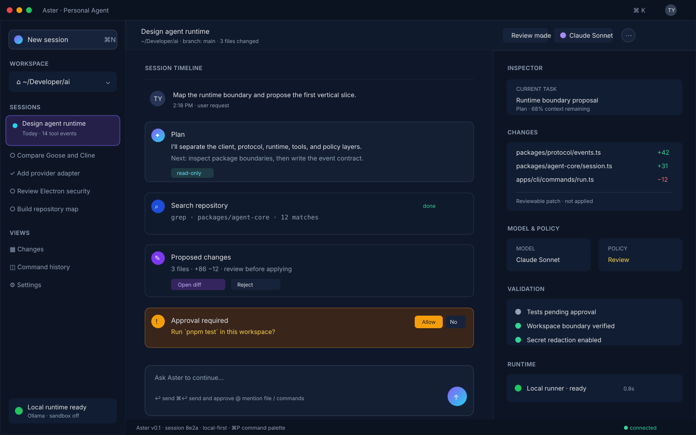

# Aster: Personal AI Frontier Tool — Open-Source Foundation, Electron Desktop, and CLI

**Research date:** 2026-09-19  
**Target platform:** macOS first; Windows/Linux later  
**Primary product:** frontier-style coding and general-purpose agent  
**Required clients:** Electron desktop app and terminal CLI  
**Status:** draft architecture and implementation plan

## Personal product name

### Recommended name: **Aster**

I recommend **Aster** as the working product name. An aster is a star-shaped flower, and the name quietly suggests a personal “star” or frontier companion without locking the product to coding, one model provider, or a specific interface. It is short, easy to pronounce, works well in commands (`aster`, `aster run`, `aster resume`), and supports a friendly visual identity.

Possible product treatments:

- **Aster** — the product name;
- **Aster Agent** — the full descriptive name;
- **Aster Runtime** — the shared execution engine;
- **Aster Desktop** and **Aster CLI** — the two clients.

### Other good candidates

| Name | Why it works | Main concern |
|---|---|---|
| **Morrow** | Feels personal, forward-looking, and calm | Less obviously technical |
| **Waypoint** | Conveys planning, navigation, and progress | Longer command name |
| **Hearth** | Suggests a private, local home for tools and context | Less frontier-oriented |
| **Kestrel** | A fast, precise “scout” metaphor for repository work | May feel more like an infrastructure product |
| **Northstar** | Clear guidance and direction metaphor | Common name with likely existing products |
| **Forge** | Strong coding and building association | Very crowded naming space |

These are creative recommendations, not trademark or domain-availability results. Before publishing, check package registries, GitHub organizations, domains, app stores, and trademark databases. For the architecture and mockup below, use **Aster** as the working name; it can be changed later without changing the runtime design.

## Executive recommendation

Yes, the tool should support both an Electron desktop mode and a CLI mode. The safest design is **one shared agent runtime with two thin clients**, not an Electron app that happens to launch a separate CLI implementation.

### Recommended foundation

Use **Goose as the closest starting point** if the Electron requirement is firm. It already has the product shape you want:

- open-source, Apache-2.0 licensed project;
- desktop app, CLI, and embeddable/API surfaces;
- Rust runtime with a TypeScript UI;
- broad model-provider support, including hosted and local models;
- MCP extensions;
- existing desktop packaging direction and custom-distribution documentation;
- a codebase that explicitly treats the agent as general-purpose, not only an IDE completion feature.

Use **Cline as the strongest architectural reference** if you are willing to port or replace its desktop shell. Cline offers a shared TypeScript SDK used by CLI, desktop, and editor integrations, plus headless JSON output, teams, schedules, plugins, and MCP. Its current desktop shell is Tauri rather than Electron, so it is not a direct Electron drop-in.

Use **OpenHands** when the central product goal is a self-hosted agent control center with remote backends, sandboxes, automations, and multiple agent servers. It is powerful, but likely too large for a first fork and has more infrastructure than a personal Electron/CLI product needs.

Do **not** begin with Continue as the base: its repository currently describes the project as no longer actively maintained and recommends its final 2.0 release. Aider remains an excellent source of CLI and Git interaction ideas, but its Python architecture makes it a less natural shared Electron foundation.

## What “frontier tool” should mean

The differentiator should not be “chat with a model.” The product should be an agent harness that can:

1. understand a repository and its working state;
2. plan before acting;
3. search, read, edit, and review files;
4. run commands, tests, linters, and builds;
5. ask for approval at meaningful risk boundaries;
6. recover from errors and iterate;
7. use MCP and first-party tools;
8. route tasks to different models or reasoning levels;
9. preserve sessions and working context;
10. expose exactly the same capabilities in desktop and CLI modes.

The product unit should be a **session**. A session contains the user request, working directory, model configuration, tool calls, approvals, patches, command output, validation results, and final response. The Electron UI and CLI are two views/controllers over this same session protocol.

## Candidate open-source foundations

### 1. Goose — best direct fit for Electron + CLI

**Repository:** `aaif-goose/goose`  
**License:** Apache-2.0  
**Observed shape:** Rust-heavy runtime, TypeScript UI, native desktop app, full CLI, API/ACP support, MCP extensions, many model providers.

**Why it fits**

- It already targets desktop and terminal users.
- Rust is a good boundary for process supervision, filesystem access, streaming events, and cross-platform packaging.
- Its provider and MCP breadth reduces the amount of integration work required.
- Its custom-distribution direction is useful for creating a branded product without designing every subsystem from zero.
- A Rust runtime can be embedded or launched as a sidecar from Electron while remaining independently usable from the CLI.

**Risks**

- The codebase is large and fast-moving; a fork can accumulate painful merge debt.
- Rust plus TypeScript creates a two-language contribution surface.
- Existing product assumptions, terminology, branding, and upstream roadmap may not match your desired frontier coding workflow.
- Confirm the exact current desktop shell and packaging path before committing to an Electron migration. Do not assume that an existing desktop app can be swapped to Electron without rebuilding native integration.

**Best use**

Fork selectively or use Goose as the runtime/design reference. Keep upstream changes isolated behind adapters where possible. Rebrand only after reviewing Apache-2.0 notice, trademark, asset, and attribution requirements.

### 2. Cline — best shared TypeScript agent-core reference

**Repository:** `cline/cline`  
**License:** Apache-2.0  
**Observed shape:** TypeScript monorepo, shared SDK, CLI, desktop app, editor integrations, headless JSON mode, MCP, plugins, teams, and schedules.

**Why it fits**

- The SDK-first shape closely matches the requirement that desktop and CLI share one engine.
- The product already models plan/act workflows, approvals, checkpoints, background tasks, multi-agent teams, and automation.
- TypeScript makes Electron integration straightforward.
- Its headless CLI patterns are a good model for CI and scripting.

**Risks**

- Its desktop implementation is currently Tauri, not Electron.
- Replacing the shell means implementing the Electron main process, preload bridge, updater, permissions, native menus, deep links, and packaging.
- The upstream project is sophisticated; extracting only the SDK may be harder than it first appears.
- Forking a product with a large active roadmap creates ongoing synchronization cost.

**Best use**

Use Cline as the reference for the shared `Agent` API, event model, permissions, plugins, and CLI behavior. If Electron is non-negotiable, port the client boundary instead of copying the entire product surface.

### 3. OpenHands — best remote/self-hosted control-plane reference

**Repository:** `OpenHands/OpenHands`  
**License:** MIT for the main repository as reported by GitHub; audit dependencies and companion repositories separately.

**Observed shape:** Agent Canvas frontend, Agent Server API, SDK/runtime, automation services, local/remote/cloud backends, and an Electron directory.

**Why it fits**

- It explicitly separates frontend/control center from agent servers and runtimes.
- It can run agents locally, in Docker, on VMs, or in cloud infrastructure.
- It has a strong model for long-running conversations, automations, and multiple backends.
- It is useful if your eventual product needs team workspaces, scheduled jobs, webhook triggers, or remote execution.

**Risks**

- It is much more infrastructure-heavy than a focused local-first tool.
- Python and TypeScript boundaries increase packaging and runtime complexity.
- Running an agent directly against a user filesystem is dangerous without sandboxing.
- A direct fork may force you to inherit product decisions for web control centers, automations, and hosted backends before validating the core desktop workflow.

**Best use**

Borrow the server boundary and remote-backend concepts. Consider OpenHands as a future execution backend rather than the first desktop application base.

### 4. Aider — best CLI and Git interaction reference

**Repository:** `Aider-AI/aider`  
**License:** Apache-2.0  
**Observed shape:** Python CLI, codebase map, multi-provider model support, Git integration, automatic testing/linting loop, and strong terminal ergonomics.

**Why it fits**

- Excellent repository map and code-edit workflow ideas.
- Mature CLI interaction and Git checkpoints.
- Clear focus on actual software changes instead of generic chat.

**Risks**

- Python packaging and runtime management are awkward inside a polished Electron distribution.
- Its architecture is CLI-first rather than shared Electron/CLI TypeScript-first.
- Embedding a Python runtime, or shipping a Python sidecar, adds startup, signing, and upgrade complexity.

**Best use**

Borrow the repository map, edit format, Git, test-loop, and terminal UX ideas. Avoid making Aider the primary Electron base unless Python is already a hard requirement.

### 5. Continue — useful historical reference, not a new foundation

**Repository:** `continuedev/continue`  
**License:** Apache-2.0.

Continue demonstrates a multi-client coding-agent architecture and provider abstraction, but its current repository notice says it is no longer actively maintained and describes version 2.0 as the final release. Use it for historical design research only unless an actively maintained successor is verified.

### 6. Open WebUI — good model UI, weak first base for a coding agent

**Repository:** `open-webui/open-webui`  
**License:** review the repository's current Open WebUI license and license history before redistribution; it is not simply an Apache/MIT dependency.

Open WebUI is strong for provider-agnostic chat, local models, RAG, memory, plugins, and a broad web UI. It is not the best starting point for a permissioned repository-editing agent. It is better treated as a model/chat integration reference, not the core coding-agent runtime.

## Decision matrix

| Criterion | Goose | Cline | OpenHands | Aider | Continue | Open WebUI |
|---|---:|---:|---:|---:|---:|---:|
| Existing CLI | 5 | 5 | 3 | 5 | 4 | 2 |
| Existing desktop direction | 5 | 4 | 4 | 1 | 2 | 3 |
| Electron fit | 4 | 5 | 3 | 2 | 4 | 3 |
| Shared runtime/API | 5 | 5 | 5 | 2 | 4 | 3 |
| Coding-agent depth | 4 | 5 | 5 | 5 | 3 | 2 |
| Remote/sandbox execution | 4 | 4 | 5 | 2 | 2 | 3 |
| Provider flexibility | 5 | 5 | 5 | 5 | 4 | 5 |
| License simplicity | 5 | 5 | 4 | 5 | 5 | 2 |
| Small first release | 3 | 3 | 2 | 4 | 3 | 3 |

Scores are directional engineering judgments, not benchmark results. The biggest practical distinction is whether you want to **adopt a mature product** or **extract a small, stable core**.

## Recommended product strategy

### Preferred route: Goose-inspired, Cline-shaped architecture

The strongest long-term choice is:

- start from Goose if you want the shortest path to desktop + CLI + providers + MCP;
- preserve a small, stable runtime contract inspired by Cline's SDK;
- use OpenHands-style execution backends later;
- borrow Aider's repository map and Git/test loop;
- build your own product identity and policy layer rather than cloning a competitor's UI.

This avoids a common failure mode: a beautiful Electron shell wrapped around an agent loop that only works through UI-specific code.

### Alternative route: direct Cline-derived Electron product

Choose this if your main advantages will be TypeScript extensibility, rapid product iteration, custom plugins, and a deep Electron ecosystem. Budget time to replace the Tauri shell and verify all native features independently.

### What not to do

Do not initially combine the complete Goose, Cline, OpenHands, and Aider codebases. Their overlapping agent loops, provider abstractions, session stores, and permission systems will create contradictory ownership boundaries. Select one runtime owner and borrow patterns from the others.

## Proposed architecture

### Monorepo layout

```text
aster/
  apps/
    desktop/                 # Electron main, preload, renderer
    cli/                     # interactive TTY and headless commands
  packages/
    agent-core/              # session state machine and orchestration
    protocol/                # versioned events, commands, schemas
    providers/               # model adapters and streaming normalization
    tools/                   # filesystem, search, shell, git, browser, MCP
    policy/                  # approvals, permissions, budgets, sandbox rules
    context/                 # repo map, indexing, compaction, memory
    persistence/             # SQLite/session/event/artifact storage
    plugins/                 # plugin lifecycle and capability registry
    evals/                   # scenario tests and regression fixtures
  native/
    runner/                  # optional Rust process/sandbox supervisor
  docs/
  package.json
  pnpm-workspace.yaml
```

The CLI and Electron app should import the same `agent-core`, `protocol`, `providers`, `tools`, `policy`, `context`, and `persistence` packages. Only presentation and host integration should differ.

### Runtime boundaries

1. **Client layer**
   - Electron renderer: chat, plan, tool timeline, diffs, terminal, approvals, settings.
   - CLI: TTY renderer, JSONL renderer, quiet exit-code mode.

2. **Host adapter**
   - Electron main/preload: secure IPC, window lifecycle, native menus, file dialogs, keychain, updater.
   - CLI process: stdin/stdout/stderr, signals, terminal resize, exit codes.

3. **Agent protocol**
   - Commands: `session.create`, `session.resume`, `message.send`, `approval.respond`, `session.cancel`, `session.export`.
   - Events: `session.started`, `assistant.delta`, `tool.started`, `tool.output`, `approval.required`, `file.changed`, `validation.completed`, `session.completed`, `session.failed`.
   - Use versioned JSON schemas so the UI and CLI can evolve independently.

4. **Agent core**
   - Planner/executor loop.
   - Tool selection and argument validation.
   - Context budget management.
   - Retry and recovery policy.
   - Stop conditions and cancellation.

5. **Tool layer**
   - Read/search: bounded file reads, ripgrep, tree-sitter or language-aware indexing.
   - Edit: patch application, atomic writes, conflict detection, undo/checkpoint.
   - Run: shell command execution with timeout, output limits, environment capture.
   - Git: status, diff, branch/worktree, checkpoint, commit only with explicit policy.
   - MCP: external tools with per-server trust and permission scopes.

6. **Execution layer**
   - Phase 1: local workspace, no hidden remote execution.
   - Phase 2: optional sandboxed subprocess/container.
   - Phase 3: remote agent server with the same protocol.

7. **Persistence layer**
   - SQLite database for sessions, messages, tool events, approvals, file snapshots, and usage.
   - Content-addressed artifact storage for large logs and diffs.
   - Export/import to JSONL or Markdown.

### Model/provider strategy

Define one normalized provider interface instead of allowing each tool to know provider-specific APIs:

- streaming text and structured tool calls;
- cancellation;
- usage and cost metadata;
- reasoning effort where supported;
- vision/input attachments where supported;
- model capability discovery;
- retry and rate-limit classification.

Start with:

1. OpenAI-compatible HTTP provider;
2. Anthropic provider;
3. Google provider if required by target users;
4. Ollama/local provider;
5. OpenRouter or another routing provider.

Keep model IDs and API keys in user settings. Store secrets in macOS Keychain through the Electron main process, not renderer local storage or session transcripts. The CLI should use the OS keychain where practical and support environment variables for CI.

### Session and event model

Treat every visible operation as an append-only event. This gives you:

- live UI updates;
- reliable resume after a crash;
- identical Electron and CLI behavior;
- replayable debugging traces;
- auditability for approvals and tool calls;
- future remote execution without redesigning the client.

A session should record the workspace root, Git revision, model configuration, policy profile, prompt, tool calls, approvals, output, and final status. Do not silently persist raw secrets or unnecessary source files.

### Permission model

Use explicit policy modes:

- **Plan:** read/search only; no writes or commands.
- **Review:** propose patches and commands; user approves each mutation.
- **Act:** allow low-risk operations; approve destructive or external operations.
- **Autonomous:** only for trusted workspaces and disposable environments.

At minimum, require approval for:

- deleting or overwriting files outside a declared workspace;
- shell commands with destructive patterns;
- network access not already approved;
- package installation;
- Git commit, push, reset, branch deletion, or force operations;
- MCP tools that mutate external systems;
- access to secrets, SSH keys, cloud credentials, or unrelated directories.

A security boundary must not depend on the model obeying the system prompt. Enforce it in the tool runner and policy package.

### Electron security design

- Keep `nodeIntegration: false`.
- Use `contextIsolation: true` and a narrow, typed preload API.
- Never expose arbitrary `ipcRenderer` or unrestricted filesystem APIs to the renderer.
- Validate every IPC payload against schemas.
- Keep shell execution and provider credentials in the main process or a supervised runtime.
- Use CSP and deny unexpected navigation/popups.
- Treat repository content, MCP responses, web pages, and model output as untrusted input.
- Add explicit prompt-injection warnings when external content requests tool use or secret access.
- Use signed builds, notarization for macOS, and an update channel with rollback support.

### CLI design

The CLI is not a debug mode of Electron. It is a first-class client with stable automation semantics.

Suggested commands:

- `frontier` — interactive session in the current directory.
- `frontier run "task"` — execute one task and stream human-readable output.
- `frontier run --json "task"` — emit versioned JSONL events.
- `frontier plan "task"` — read-only plan.
- `frontier resume <session-id>` — resume a session.
- `frontier diff` — show agent changes.
- `frontier approve <request-id>` — respond to a pending approval.
- `frontier models` — list configured providers/models.
- `frontier mcp list|add|remove` — manage MCP servers.
- `frontier doctor` — diagnose credentials, tools, workspace, and sandbox availability.

Automation requirements:

- deterministic exit codes;
- no ANSI output in JSON mode;
- stdout reserved for protocol/results and stderr for diagnostics;
- signal handling for Ctrl-C and CI cancellation;
- bounded output and log files;
- `--yes`/autonomous mode only when explicitly supplied;
- never print API keys or environment values by default.

## MVP scope

### MVP goal

A local-first coding agent that can complete small-to-medium repository tasks from either Electron or CLI, with visible plans, reviewable patches, tests, and safe approvals.

### Include

- macOS Apple Silicon and Intel builds;
- Electron desktop window with session list and live timeline;
- CLI interactive and headless JSONL modes;
- OpenAI-compatible, Anthropic, and Ollama providers;
- repository search, bounded reads, patch edits, shell/test runner, Git diff;
- Plan/Review/Act policy modes;
- session resume and export;
- SQLite persistence;
- MCP stdio/HTTP support with manual server approval;
- basic cost/token accounting;
- evaluation fixtures for edit correctness, tool safety, and recovery.

### Defer

- multi-user cloud workspaces;
- live collaboration;
- remote execution;
- autonomous scheduled agents;
- voice and image generation;
- full IDE plugins;
- vector RAG for arbitrary documents;
- agent teams until single-agent traces are reliable.

## Phased implementation plan

### Phase 0 — due diligence and fork boundary

- Pin the exact upstream commit and record licenses/notices.
- Build Goose and inspect its desktop/CLI/runtime boundaries.
- Build Cline SDK/CLI and document which parts are reusable without its shell.
- Decide whether to fork Goose, port Cline's core, or create a clean runtime using both as references.
- Write a dependency and trademark inventory.

**Exit criterion:** a short architecture decision record with one runtime owner and no duplicated agent loop.

### Phase 1 — protocol-first vertical slice

- Define protocol schemas and event envelopes.
- Implement one provider adapter and one streaming tool-call path.
- Implement read/search, patch edit, shell, and Git status/diff tools.
- Implement a CLI `run --json` command.
- Add a replay test that feeds recorded events into a fake client.

**Exit criterion:** a CLI task can inspect a repo, make a patch, run a test, and return a stable JSONL trace.

### Phase 2 — safe local runtime

- Add Plan/Review/Act policy enforcement.
- Add cancellation, timeouts, output limits, and retries.
- Add SQLite session persistence and resume.
- Add checkpoints and patch rollback.
- Add secret redaction and workspace-boundary tests.

**Exit criterion:** unsafe tool calls are blocked by code, not merely discouraged by prompts.

### Phase 3 — Electron client

- Add Electron main process and secure preload bridge.
- Build session list, prompt composer, plan view, tool timeline, approval dialogs, diff viewer, and terminal output.
- Add native file/folder selection and keychain integration.
- Make Electron attach to the same runtime protocol used by the CLI.
- Add crash-safe resume and renderer/main-process error reporting.

**Exit criterion:** the same session can be started in CLI, resumed in Electron, and exported identically.

### Phase 4 — provider and extension surface

- Add Anthropic, OpenAI-compatible, Google, Ollama, and routing-provider adapters as needed.
- Add MCP server management and capability approval.
- Add plugin API with versioned lifecycle hooks.
- Add model profiles such as fast, balanced, deep, and local.
- Add usage/cost dashboard and per-session budgets.

**Exit criterion:** a third-party provider and tool can be added without modifying the core orchestration loop.

### Phase 5 — sandbox and remote execution

- Introduce a supervised runner process first.
- Add Docker or VM-backed sandbox for untrusted repositories.
- Define the remote Agent Server API using the existing event protocol.
- Add reconnect, heartbeats, cancellation, and artifact transfer.
- Add optional scheduled/webhook execution only after policy and audit logs are mature.

**Exit criterion:** a session can move from local to isolated remote execution without changing the client contract.

### Phase 6 — product differentiation

Potential differentiators based on your existing research:

- transparent model routing and second-opinion review;
- high-quality repository map and dependency-aware context;
- first-class validation loop with test evidence;
- session/thread sharing and durable task history;
- Chinese/English UX and documentation for Hong Kong users;
- local-first privacy mode with Ollama;
- reproducible agent traces for debugging and evaluation;
- a polished keyboard-driven Electron workspace plus excellent CLI automation.

## Evaluation and quality gates

Do not judge the product only by demo success. Create a regression set covering:

- locate and explain a symbol;
- make a small isolated edit;
- make a coordinated multi-file edit;
- diagnose a failing test;
- recover from a failed shell command;
- refuse a destructive command in Review mode;
- preserve unrelated changes;
- respect ignored files and workspace boundaries;
- resume after process restart;
- produce valid JSONL under streaming and cancellation;
- handle prompt injection in repository files and tool output;
- redact secrets from logs and model context where configured.

Track task success, test-pass rate, unnecessary edits, tool-call count, latency, token/cost use, approval frequency, crash/recovery rate, and unsafe-action refusal rate.

## High-level desktop UI mockup

The first desktop screen should make the agent's work observable rather than hiding it behind a chat bubble. The proposed layout has five areas:

1. **Workspace and session rail** — switch repositories, resume sessions, and open changes or settings.
2. **Session timeline** — show the user request, plan, tool calls, proposed patches, approvals, and validation evidence in order.
3. **Composer** — send the next instruction, attach context, or use keyboard commands.
4. **Inspector** — show changed files, model, policy mode, context budget, and validation status.
5. **Runtime status** — make local/remote execution, provider, sandbox state, and connection health visible.

The mockup intentionally shows a **Review mode** session with a proposed diff and a pending test approval. This is the core trust-building loop for a personal agent: the user can see what Aster intends to do before allowing a mutation or command.



Source file: [`2026_09_19_aster_agent_ui_mock.svg`](2026_09_19_aster_agent_ui_mock.svg)

### UI design principles

- Keep the timeline readable when tool output becomes long; collapse raw logs by default.
- Give every mutation a visible diff and a reversible checkpoint.
- Keep model and policy controls near the session header, not buried in settings.
- Make the same session inspectable from the CLI through JSONL events.
- Prefer keyboard-first actions: new session, command palette, approve, reject, open diff, and resume.
- Reserve visual emphasis for risk: approvals, external network calls, destructive commands, and secrets.

## Licensing and fork checklist

Before publishing a branded derivative:

1. confirm each upstream license at the exact commit used;
2. preserve copyright and license notices;
3. inventory transitive licenses and model/provider terms;
4. check trademark and logo restrictions separately from copyright;
5. do not imply endorsement by Goose, Cline, OpenHands, Aider, Electron, or providers;
6. publish source and notices required by the applicable licenses;
7. review whether any bundled fonts, icons, models, or generated assets have separate terms;
8. obtain legal review before commercial distribution or hosted service launch.

Apache-2.0 and MIT are generally permissive, but “permissive” does not mean “no obligations.” This is product guidance, not legal advice.

## Final decision

For your stated requirement, I would choose this order:

1. **Prototype from Goose** if Electron + CLI are both immediate requirements and you want the most existing product surface.
2. **Use Cline's SDK architecture as the reference** for a clean shared TypeScript core, especially if your product will be heavily plugin- and workflow-driven.
3. **Borrow OpenHands' server/backend separation** when remote or scheduled execution becomes important.
4. **Borrow Aider's repository map, Git, and test-loop ergonomics** regardless of the selected base.

The central architectural rule is: **Electron and CLI must be clients of the same versioned agent protocol and runtime.** If that rule is maintained from the first vertical slice, CLI support is not only possible—it becomes an advantage for automation, CI, debugging, and power users.

## Sources checked

- Goose: https://github.com/aaif-goose/goose
- Cline: https://github.com/cline/cline
- OpenHands: https://github.com/OpenHands/OpenHands
- Aider: https://github.com/Aider-AI/aider
- Continue: https://github.com/continuedev/continue
- Open WebUI: https://github.com/open-webui/open-webui
- Electron: https://github.com/electron/electron
- Tauri: https://github.com/tauri-apps/tauri

Repository status, releases, features, and licenses change over time. Re-check upstream repositories and their full license files immediately before starting a fork or shipping a derivative.
