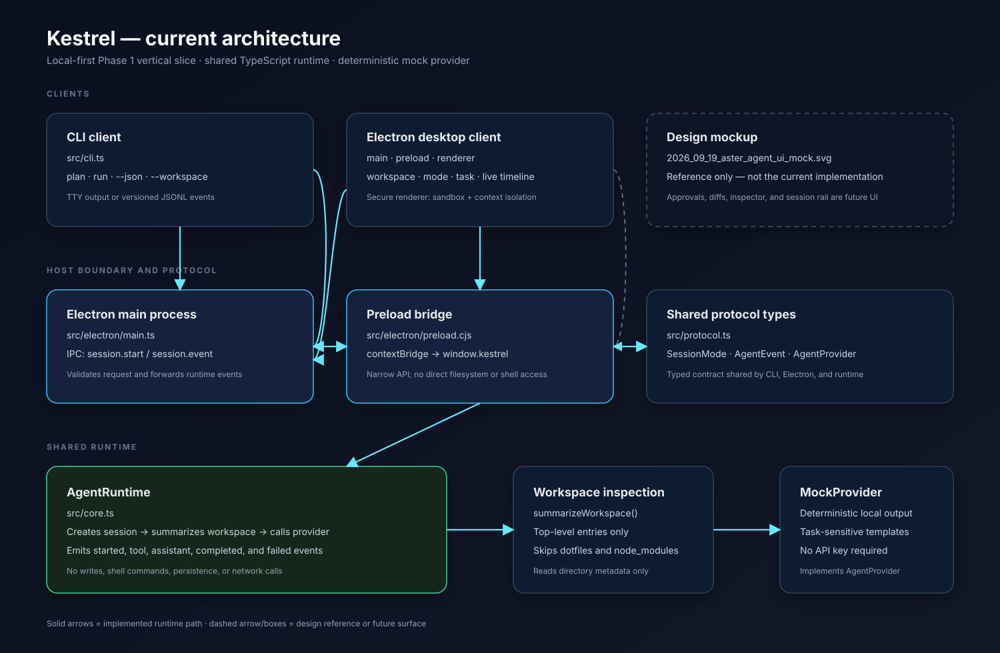

# Kestrel Current Architecture

**Document date:** 2026-09-20  
**Project version:** `0.1.0`  
**Audience:** Developers evaluating, demoing, or extending the current Kestrel prototype

## Executive summary

Kestrel is a local-first AI frontier-agent prototype with two clients over one
shared TypeScript runtime:

- a CLI for terminal and JSONL workflows;
- an Electron desktop client for entering tasks and viewing a live event timeline.

The current implementation is deliberately a **no-network local mock**. It
does not connect to an LLM, modify files, execute shell commands, persist
sessions, or use API keys. The runtime reads a bounded top-level workspace
listing and generates a deterministic, task-sensitive response.

## System diagram



The SVG uses solid paths for implemented behavior and dashed styling for the
design reference or future surfaces.

## Repository map

```text
Kestrel/
├── src/
│   ├── cli.ts                    # CLI argument parsing and event rendering
│   ├── core.ts                   # AgentRuntime, MockProvider, workspace summary
│   ├── protocol.ts               # Shared commands, events, modes, provider type
│   └── electron/
│       ├── main.ts               # BrowserWindow, IPC, runtime orchestration
│       ├── preload.cjs           # Secure renderer bridge
│       └── renderer/index.html   # Desktop workspace UI
├── tests/core.test.ts            # Runtime and provider regression tests
├── scripts/copy-renderer.mjs     # Copies renderer and preload into dist
├── dist/                         # Generated TypeScript/Electron build output
├── package.json
├── tsconfig.json
└── 2026_09_20_kestrel_architecture.md
```

## Runtime components

### 1. Shared protocol

`src/protocol.ts` defines the contracts shared across clients and runtime:

- `SessionMode`: `plan`, `review`, or `act`;
- `AgentCommand`: the intended command vocabulary for session creation,
  message sending, and cancellation;
- `AgentEvent`: the event stream consumed by CLI and Electron;
- `AgentSession`: session metadata;
- `AgentProvider`: the current provider boundary.

The implemented runtime currently emits:

```text
session.started
tool.started
tool.output
assistant.delta
session.completed
```

On failure it emits `session.failed`. `approval.required` exists in the type
union but is not emitted by the current runtime.

The current provider interface is intentionally small:

```ts
interface AgentProvider {
  respond(input: {
    prompt: string;
    workspaceSummary: string;
  }): Promise<string>;
}
```

This supports the current one-shot mock flow. It does not yet model streaming
chunks, tool calls, approvals, cancellation, usage, or provider errors.

### 2. Agent runtime

`src/core.ts` contains `AgentRuntime`, the single runtime owner used by both
clients:

1. Creates a session ID with `randomUUID()`.
2. Normalizes the workspace path.
3. Emits `session.started`.
4. Emits `tool.started` for `workspace.summary`.
5. Calls `summarizeWorkspace()`.
6. Emits the resulting `tool.output`.
7. Calls the configured `AgentProvider`.
8. Emits the provider response as `assistant.delta`.
9. Emits `session.completed`.
10. Converts runtime errors into `session.failed`.

The default provider is `MockProvider`. The runtime accepts a provider in its
constructor, which leaves a clean seam for a future real provider without
duplicating orchestration logic.

### 3. Workspace inspection

`summarizeWorkspace(workspace)` uses Node's filesystem API to read one
directory level. It:

- includes at most the first 30 entries;
- excludes dotfiles;
- excludes `node_modules`;
- labels entries as `file:` or `dir:`;
- returns `empty workspace` when no visible entries are found.

It does not read file contents, search symbols, inspect Git state, or modify the
workspace.

### 4. Deterministic mock provider

`MockProvider` turns the prompt and workspace summary into a local response
without network access. It recognizes a few task categories:

- testing and Vitest requests;
- documentation and README requests;
- source, repository, tree, and workspace inspection requests;
- a general task-plan fallback.

The output is intentionally predictable for demos and tests. It is not model
reasoning and should not be presented as a production AI result.

## CLI architecture

`src/cli.ts` is a thin client over `AgentRuntime`.

Supported commands:

```text
kestrel <plan|run> <task> [--json] [--workspace <path>]
```

Examples:

```bash
npm run start:cli -- plan "Map the current project"
npm run start:cli -- run "What tests should I run?"
npm run start:cli -- run --workspace /path/to/repo "Inspect the source tree"
npm run start:cli -- run --json "Summarize this workspace"
```

Behavior:

- `plan` uses `plan` mode;
- `run` uses `review` mode;
- `--workspace` selects the inspected directory;
- `--json` emits `{ "version": 1, ...event }` JSONL records;
- human-readable failures are written to stderr and set a non-zero exit code.

The CLI does not implement interactive prompts, session resume, approval
commands, Git commands, or shell execution yet.

## Electron architecture

### Main process

`src/electron/main.ts`:

- creates a `BrowserWindow`;
- enables `contextIsolation`, disables `nodeIntegration`, and enables sandboxing;
- loads the compiled renderer from `dist/electron/renderer/index.html`;
- exposes `session.start` IPC handling;
- creates a new `AgentRuntime` for each submitted session;
- forwards each runtime event to the renderer as `session.event`;
- logs renderer console messages and preload failures.

The main process validates the workspace, task, and mode shape before starting
the runtime. It does not expose arbitrary shell or filesystem methods to the
renderer.

### Preload bridge

`src/electron/preload.cjs` is intentionally small because the renderer is
sandboxed. It exposes only:

```text
window.kestrel.startSession(request)
window.kestrel.onEvent(listener)
```

The bridge translates those methods to:

```text
ipcRenderer.send("session.start", request)
ipcRenderer.on("session.event", ...)
```

The renderer never receives direct access to `ipcRenderer`, Node.js, the
filesystem, or provider credentials.

### Renderer

`src/electron/renderer/index.html` is a self-contained HTML/CSS/JavaScript
workspace UI. It currently provides:

- workspace path input;
- policy-mode selector;
- task textarea;
- Run session button;
- New session reset;
- runtime status;
- live event timeline;
- capability notes explaining current limitations.

It is a functional first workspace, not the full design mockup. The mockup's
session rail, approval dialogs, diff viewer, inspector, and settings are not
implemented.

## Build and asset flow

The project uses TypeScript with NodeNext modules:

```text
src/*.ts ──tsc──> dist/*.js
src/electron/renderer/index.html ──copy script──> dist/electron/renderer/index.html
src/electron/preload.cjs ──copy script──> dist/electron/preload.cjs
```

The build command is:

```bash
npm run build
```

It runs `tsc -p tsconfig.json` and then
`scripts/copy-renderer.mjs`. The copy step is required because TypeScript
compiles code but does not copy HTML or CommonJS preload assets.

The desktop command is:

```bash
npm run start:desktop
```

This builds first and then launches Electron with
`dist/electron/main.js`.

## End-to-end request flow

### CLI flow

```text
Terminal
  → src/cli.ts parses command
  → AgentRuntime.run(prompt, workspace, mode)
  → summarizeWorkspace(workspace)
  → MockProvider.respond(...)
  → AgentEvent stream
  → human output or JSONL
```

### Electron flow

```text
Renderer form submit
  → window.kestrel.startSession(...)
  → preload.cjs
  → IPC session.start
  → electron/main.ts validation
  → AgentRuntime.run(...)
  → runtime AgentEvent stream
  → IPC session.event
  → preload onEvent(...)
  → renderer timeline
```

This shared runtime path is the central architectural property: the CLI and
Electron client do not implement separate agent loops.

## Security posture of the current prototype

Implemented safeguards:

- renderer `nodeIntegration: false`;
- `contextIsolation: true`;
- Electron sandbox enabled;
- narrow preload API;
- no network provider;
- no secret storage;
- no shell execution;
- no file mutation.

Current limitations:

- IPC request validation is structural, not a complete workspace policy;
- the renderer accepts a workspace path supplied by the user;
- there is no authentication because the app is local-only;
- there is no audit log or persistence;
- there is no prompt-injection or untrusted-content handling yet.

## Testing and quality gates

The current test suite is in `tests/core.test.ts` and verifies:

- workspace summaries exclude `node_modules` and dotfiles;
- the runtime emits a complete successful event sequence;
- task-sensitive mock responses differ for testing and documentation prompts.

Run all checks:

```bash
npm run typecheck
npm test
npm run build
```

## Current scope versus the original design

Implemented now:

- one shared TypeScript runtime;
- CLI and Electron clients;
- versioned JSONL event rendering in the CLI;
- secure preload bridge and live Electron timeline;
- deterministic task-sensitive local provider;
- bounded top-level workspace inspection;
- build-time renderer/preload asset copying;
- basic tests.

Not implemented now:

- real hosted or local LLM provider;
- streaming model responses;
- file reads, symbol search, patch editing, or atomic writes;
- shell/test command execution;
- Git status, diff, checkpoints, commits, or rollback;
- approval and policy enforcement;
- SQLite persistence, resume, export, or session history;
- MCP servers and plugins;
- packaged, signed, or notarized macOS distribution;
- full design-mockup UI.

## Demo script for developers

1. Install dependencies:

   ```bash
   npm install
   ```

2. Run checks:

   ```bash
   npm run typecheck
   npm test
   ```

3. Demonstrate the CLI:

   ```bash
   npm run start:cli -- run "What tests should I run?"
   npm run start:cli -- run "Update the documentation"
   npm run start:cli -- run --json "Inspect the source tree"
   ```

4. Demonstrate the Electron client:

   ```bash
   npm run start:desktop
   ```

   Use workspace `.`, choose `Review`, enter a task, and click **Run session**.
   Show the `session.started`, `workspace.summary`, `assistant.delta`, and
   `session.completed` cards in the timeline.

5. Explain the boundary: the current output is deterministic mock behavior,
   while `AgentProvider` is the future insertion point for a real model.

## Extension points

The safest next changes should preserve these boundaries:

1. Add a real provider implementation behind `AgentProvider`.
2. Extend the protocol for streaming, tool calls, and cancellation.
3. Add bounded read/search tools before adding mutation tools.
4. Add a policy layer before shell, Git, MCP, or file writes.
5. Add persistence around append-only events rather than client-specific state.
6. Keep Electron and CLI as clients of the same runtime.

The core design rule remains: **the CLI and Electron desktop must continue to
use the same versioned runtime and event contract.**
